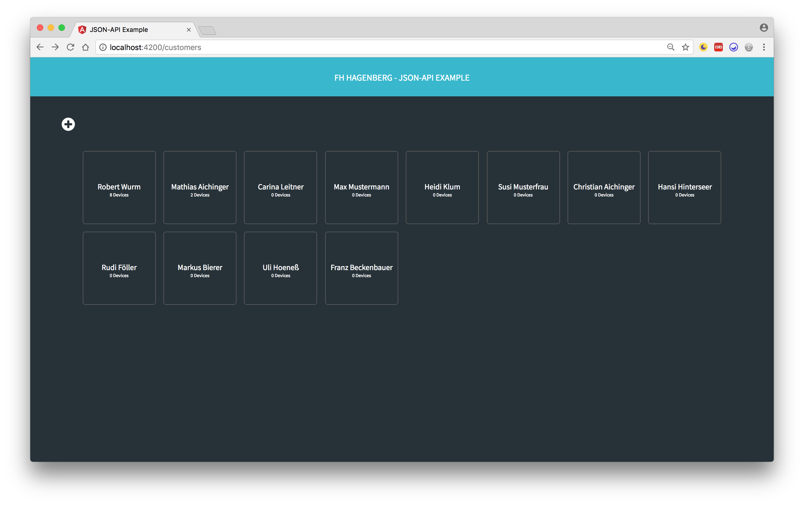
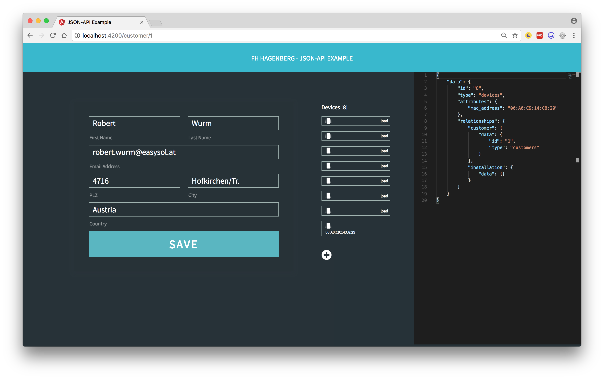
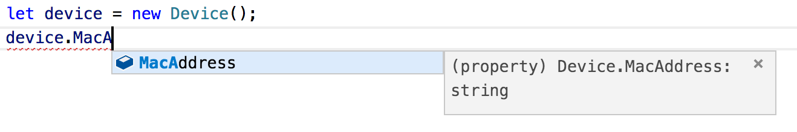

# Frontend

The frontend demonstrats how a [Angular](https://angular.io/) + [TypeScript](https://www.typescriptlang.org/) client can integrate a [json:api](http://jsonapi.org/) rest server very easy. The aim of the project was the creation of generic base classes that frontend developers can communicate with json:api conform rest services most efficient as possible. The sample frontend (see screenshots) demonstrateds some basic technicians about creating, updating, fetching models and how you can handle model relationships.


## The sample frontend

The sample project has implemented the models:

- Customer
- Device
- Installation

<p align="center">
    
</p>
The view above lists all customers in a grid.

<p align="center">
    
</p>
In this view you can create and update a customer. On the right side you can always view the models json:api conform structure. Hence you can also add devices to the customer you can always watch how the json structure will change. With the load button you can lacy load relations.


### Development server

Run `ng serve` for a dev server. Navigate to `http://localhost:4200/`. The app will automatically reload if you change any of the source files.

### Build

Run `ng build` to build the project. The build artifacts will be stored in the `dist/` directory. Use the `-prod` flag for a production build.


## Base Classes


### BaseModel

This class allows the definition of individual model classes which are represented as json:api conform structure from the backend.


```bash
export class Device extends BaseModel {
  
  public constructor(id?: string) {
    super("type", id);
  }
}
```

### BaseAttribute

This generic class allows the definition of attributes at a model. You can define a datatype and string which is the key from the backend attribute name.

```bash
{
  "data": {
    "id": "10",
    "type": "devices",
    "attributes": {
      "mac_address": "00:A0:C9:14:C8:30"
    },
    "relationships": {
      "customer": {
        "data": {
          "id": "2",
          "type": "customers"
        }
      },
      "installation": {
        "data": {}
      }
    }
  }
}
```

```bash
private macAddress = new BaseAttribute<string>("mac_address");
```

After this definition you have the possibility the create very simple a model and work with the attributes type save.

<p align="left">
    
</p>


### ModelRelation

With this class you define relations to other models:

```bash
private customer = new ModelRelation<Customer>(this, "customer", "customers");
```

With a assignment to the relation attribute you can set relations:
```bash
let device = new Device();
let customer = new Customer();
device.Customer.Data = customer;
```
or only set the id:
```bash
let device = new Device();
device.Customer.Id = "1234";
```


### ModelRelationMany

With this class you can define many relations to other models:
```bash
private devices = new ModelRelationMany<Device>(this, "devices", "devices");
```
This attributes has methods like:

- AddRelation
- RemoveRelation

You can iterate over all relations:

```bash
for(let deviceRelation of customer.Devices.Relations) {
  console.log(deviceRelation.Id); // prints the id of the device
  console.log(deviceRelation.Data); // prints the device model
}
```


## Services


### BaseModelService

This abstract class allows you creating model services with all base operations very efficient: 

```bash
@Injectable()
export class CustomerService extends BaseModelService<Customer> {
  public constructor(http: Http) {
    super(Customer, "Customer", `http://..../customers`, http);
  }
}
```

The service has now methods like:

- getById
- getAll
- getAll with filters
- getByPage
- add
- update
- remove

The service also has caching and error handling included.


### Fetch Relations

```bash
async loadDeviceRelation(deviceRelation: ModelRelation<Device>) {
	deviceRelation.Data = await this.deviceService.getById(deviceRelation.Id).toPromise();
}
```


## Possible improvements

The implementation of all base classes are very simple and has all most importand features included. Anyway, there are some implementation compromises which are a bit disturbing and could get improved.


### BaseModel

Every BaseModel has to implement the Method `initWithJson`:

```bash
public initWithJson(dataEntry: any) {
  super.initWithJson(dataEntry);

  this.MacAddress = this.attribute(this.macAddress.key);
  this.customer = this.relationship(this.customer.Key, this.customer.Type);

  this.resetDirtyAttributes();
}
```

If you are working with relations you also have to call the `setRelationship` method for each Relation:

```
public constructor(id?: string) {
  super("devices", id);
  this.setRelationship(this.installation);
  this.setRelationship(this.customer);
}
```

### BaseModelService


If you will get all relations from a model you have to iterate over all relations and call the `getById` method. So you have a lot of traffic overhead and the performance would be much better if the service could work with [included](http://jsonapi.org/format/#fetching-relationships) data. So there still exists the classic n+1 rest api problem. 


```bash
private async fetchAllDevicesForCustomer(customer: Customer) {
  for(let deviceRelation of customer.Devices.Relations) {
    if(deviceRelation.Data == null) { // not fetched until yet
      deviceRelation.Data = await this.deviceService.getById(deviceRelation.Id).toPromise();
    }
  }
}
```


